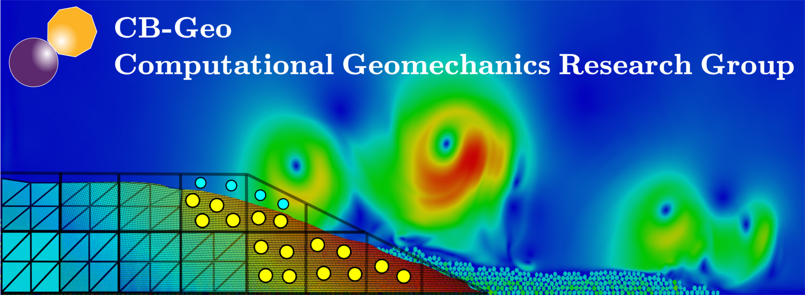

## Research
Welcome to the CB-Geo computational geomechanics research group. We develop open source numerical tools and methods to solve complex geomechanics problems. We encourage you to make use of our infrastructure and tools, and also contribute towards the development of geomechanics.

### Numerical Methods

* [Material Point Method]({{ site.url }}/research/mpm/)

The Material Point Method (MPM) is a hybrid Eulerian-Lagrangian approach, which uses moving material points and computational nodes on a background mesh. This approach is very effective particularly in the context of large deformations.

* [Lattice Boltzmann Method]({{ site.url }}/research/lbm/)

The Lattice Boltzmann equation Method (LBM) is a meso-scale fluid solver for modeling grain-scale fluid flow. The Discrete-Element Method (DEM) is coupled with LBM to model soil-fluid interactions at particulate scale. 

* [Lattice Element Method]({{ site.url }}/research/dlm/)

Lattice Element Method (LEM) is a novel technique which involves coupling the solid lattice system and  the fluid lattice system to model the multi-physics problem.

